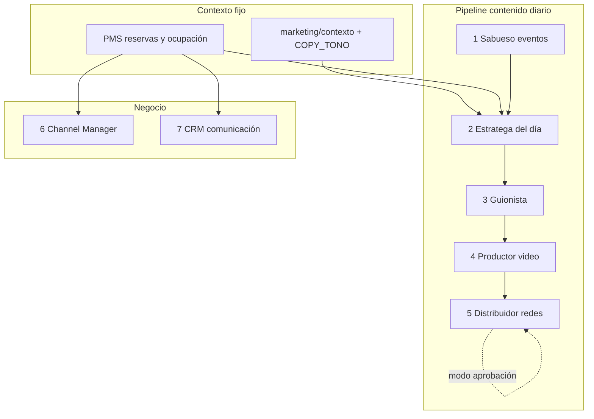

# Visión — Equipo de agentes Terra Natura (objetivo final)

**Fin primordial del dueño:** un equipo de agentes que, con supervisión mínima:

1. Arme **guiones** y **videos** para cada día.
2. **Publique** en Instagram, Facebook, Google Business, TikTok (cuando aplique) y **Estado de WhatsApp**.
3. Opere **CRM** (leads, mensajes pre/durante/post estadía).
4. Opere **channel manager** (calendario único, Booking/Airbnb/directo).
5. Automatice **canales de comunicación** (WhatsApp, email transaccional).

**Motor de IA:** Cursor (plan ~USD 20) + reglas/skills del repo. **No** API Claude como requisito.

---

## Qué existe HOY (ya creado en el proyecto)

### A) Agentes Python — ejecutables desde el panel

Carpeta `agents/`. Panel: **http://127.0.0.1:8000/agentes** · Ciclo: `local/Ejecutar-agentes-diario.bat`

| ID | Nombre | Función real hoy | Publica solo en redes |
|----|--------|------------------|------------------------|
| `channels` | Channel Manager | Ocupación 7d, estado OTAs, URLs iCal, modo solo directo | No |
| `calendar` | Calendario editorial | Plan 90 días, guiones en JSON, puede disparar **generación de videos** (MoviePy) | No |
| `crm` | CRM & comunicación | Leads en JSON, borradores WhatsApp por reserva | No (no envía) |
| `content` | Contenido & redes | Revisa calendario AMA, sugiere semana, alertas feriados | No |

**Orquestador:** `agents/core/orchestrator.py` — orden diario: channels → calendar → crm → content.

### B) Módulo AMA — fábrica de contenido (sin publicar)

Carpeta `ama/`: fotos, guiones (`script_generator.py`), videos (`editorial_reel_builder.py`, `slideshow_builder.py`), calendario (`publicaciones_calendario.json`), copy (`copy_prompts.yaml`).

**Hoy:** generás video/copy → **vos copiás y publicás** (`docs/QUE_PUEDE_Y_NO_PUEDE.md`).

### C) Marketing / voz (plan estratégico)

Carpeta `marketing/` + `docs/COPY_TONO_MARCA.md` + regla Cursor `.cursor/rules/terra-natura-voz-marketing.mdc`.

**Función:** enseñar tono y plan HubSpot; **no** publica.

### D) PMS (reservas, precios, disponibilidad)

`backend/` — base del channel manager y del CRM cuando esté conectado a BD.

---

## Qué NO existe todavía (gap hasta tu objetivo final)

| Capacidad | Estado |
|-----------|--------|
| Publicar solo en Instagram/Facebook | Pendiente — `ama/publishers/meta_publisher.py` (documentado, no implementado) |
| Publicar Estado WhatsApp vía API | Pendiente — WhatsApp Cloud API o flujo n8n |
| TikTok auto-post | Pendiente — API o manual |
| Agente único “día completo: guion → video → publicar” | **No hay** — hay tareas separadas |
| CRM con WhatsApp entrante automático | Parcial — leads JSON, sin webhook |
| iCal import Booking/Airbnb bidireccional | Parcial — export y estado |

---

## Equipo objetivo (7 agentes) — diseño alineado al video + tu meta

| # | Agente | Rol | Implementación actual | Cursor skill (instrucciones) |
|---|--------|-----|----------------------|------------------------------|
| 1 | **Sabueso** | Eventos que llenan Bialet | `ama/scrapers/` + `sources_cordoba_turismo.py` | Pendiente skill |
| 2 | **Estratega del día** | Qué publicar hoy según ocupación + evento + objetivo directo | Parcial en `calendar` + `content` | Pendiente skill |
| 3 | **Guionista** | Guion 15–45 s + caption por red | `ama/engine/script_generator.py` | `.cursor/skills/terra-natura-guionista/` |
| 4 | **Productor video** | MP4 desde fotos/música/plantilla | `ama/video/editorial_reel_builder.py` | `.cursor/skills/terra-natura-video/` |
| 5 | **Distribuidor** | Publicar en IG/FB/GBP/WA Status | **Falta** `ama/publishers/` | `.cursor/skills/terra-natura-distribuidor/` |
| 6 | **Channel Manager** | Anti-overbooking, iCal, directo vs OTA | `agents/channels/` | Pendiente skill |
| 7 | **CRM** | Leads, mensajes, post-estadía | `agents/crm/` | Pendiente skill |

**Modos (AGENTS.md):** 🟡 aprobación (dueño confirma) → 🟢 automático cuando la calidad y APIs estén estables.

---

## Fases de implementación (orden recomendado)

### Fase 1 — Agentes que ya casi funcionan (2–4 semanas)
- Completar contexto en `marketing/contexto/`.
- Unificar **un comando diario**: plan del día → guion → video en carpeta `marketing/resultados/YYYY-MM-DD/`.
- Modo 🟡: panel `/marketing` muestra preview; vos publicás manual.

### Fase 2 — Distribuidor con APIs (requiere cuentas Meta + WhatsApp Business)
- Implementar `ama/publishers/meta_publisher.py`.
- Cola `publicaciones_calendario.json` con estados: `borrador` → `aprobado` → `publicado`.
- Agente Python `agents/publisher/` o ampliar `calendar`.

### Fase 3 — CRM + comunicación
- Webhook WhatsApp Cloud (consultas → lead → respuesta sugerida).
- Plantillas RQ-17 (pre/durante/post) desde `agents/crm/`.

### Fase 4 — Channel manager completo
- iCal import + reglas `disponibilidad_service` (RQ-04–06).

---

## Cómo “crear agentes” con Cursor (sin Claude)

| Tipo | Dónde | Para qué |
|------|-------|----------|
| **Agente ejecutable** (corre solo) | `agents/<nombre>/agent.py` + registro en `registry.py` | Panel `/agentes`, cron `.bat` |
| **Skill Cursor** (instrucciones al chat) | `.cursor/skills/terra-natura-*/SKILL.md` | Diseñar/refinar guiones, briefs, copy con vos |
| **Regla siempre activa** | `.cursor/rules/*.mdc` | Tono, seguridad, no Punilla en público |
| **Contexto editable** | `marketing/contexto/`, `docs/COPY_TONO_MARCA.md` | Lo que el agente “sabe” del negocio |

Los agentes del **video de Migue Baena** son archivos Markdown + skills; los **tuyos en producción** deben ser **Python + skills** (código ejecuta, Cursor mejora).

---

## Próximo paso concreto (1 solo)

Definir y programar el agente **«Pipeline diario»** (`agents/daily_media/` o tarea única en `calendar`):

1. Lee ocupación + evento del día.  
2. Escribe guion + captions → `marketing/resultados/<fecha>/`.  
3. Genera MP4 → `ama/output/videos/`.  
4. Encola publicación (manual Fase 1 / API Fase 2).

Cuando confirmes, se implementa ese agente primero; el resto del equipo se engancha después.
