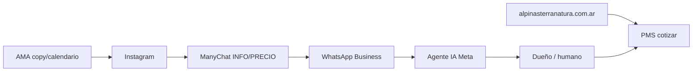

# WhatsApp Business — agente IA (Meta) al máximo

Guía para el **asistente de IA gratuito** de WhatsApp Business (Meta), integrado con Terra Natura.

**Prompt maestro del negocio:** `docs/WHATSAPP_IA_PROMPT_MAESTRO.md`  
**Biblioteca de mensajes:** `docs/BIBLIOTECA_MENSAJES_WHATSAPP.md`  
**Cotización real:** `backend/services/pricing_engine.py` + calendario `ama/data/calendario_comercial_2026.json`

---

## Qué puede hacer el agente IA de Meta (aprovechar al máximo)

| Capacidad | Uso Terra Natura |
|-----------|------------------|
| **FAQ 24/7** | Check-in/out, ubicación, pileta, mascotas, formas de pago, seña 50 % |
| **Calificación** | Fechas, personas, tipo unidad (pareja → alpina/suite) antes de derivar |
| **Tono de marca** | Pegar instrucciones de `WHATSAPP_IA_PROMPT_MAESTRO.md` en “Instrucciones para la IA” |
| **Catálogo / fotos** | Enviar link a web o PDF guía huésped (no subir 50 fotos sueltas) |
| **Handoff a humano** | Palabras: “hablar con dueño”, “queja”, “caso especial” → notificación a vos |
| **Horario** | Fuera de horario: captar lead + “te respondemos a la mañana” |
| **Idioma** | Español Argentina; vos cordobés sutil |

**Limitaciones importantes:**

- No reemplaza el **PMS** (disponibilidad real, anti-overbooking).  
- Montos exactos: la IA debe decir *“te confirmo el total en un momento”* o usar rangos del calendario comercial hasta conectar API.  
- **No prometer** lo que no está en `docs/REGLAS_NEGOCIO.md`.

---

## Educar al agente (paso a paso)

1. **WhatsApp Business** → Configuración → **Asistente de IA** / AI assistant.  
2. **Descripción del negocio** (copiar adaptado):

   > Complejo de 5 cabañas en Bialet Massé, Córdoba. Alpinas para pareja/familia chica; Suites loft. Pileta, parque, dueños en el predio. Reserva directa web y WhatsApp. Seña 50 %, cancelación según política.

3. **Instrucciones** — pegar bloques de `WHATSAPP_IA_PROMPT_MAESTRO.md`:
   - Nunca solo precio: valor → fechas/personas → tarifa orientativa  
   - Invierno julio: 5+1 (6 noches, pagás 5)  
   - Baja mayo–junio: 4 paga 5  
   - Alta: Alpina $120k / Suite $100k noche (orientativo 2026)  
   - Resto: $100k / $85k  
   - Sin “Punilla” en mensajes; decir sierras, Bialet, lago San Roque  

4. **Preguntas frecuentes** — importar desde `BIBLIOTECA_MENSAJES_WHATSAPP.md` (check-in 15h, out 10h, WiFi, fogón, ruido, mascotas si aplica).

5. **Prohibido** — inventar disponibilidad, confirmar reserva sin pago, competir con Booking con datos falsos.

---

## Conectar con el resto del stack

| Conexión | Estado recomendado |
|----------|-------------------|
| Instagram → ManyChat | Comentarios INFO/PRECIO → DM → `wa.me` |
| ManyChat → WhatsApp | Mismo número Business verificado |
| Web reservas | Link en respuestas IA + biblioteca |
| PMS local | Dueño cotiza en panel con `pricing_engine` (promo auto julio/baja) |
| Meta API (AMA) | Opcional: publicar IG desde panel si hay tokens |

**V2 (cuando haya backend en producción):** webhook WhatsApp Cloud API → `ama/chat/responder.py` + disponibilidad en tiempo real.

---

## Flujo de venta que la IA debe respetar

1. Saludo + empatía (escapada, descanso).  
2. Preguntar **fechas** y **cantidad de personas**.  
3. Sugerir unidad (pareja → alpina o suite; familia → alpina).  
4. Beneficio (pileta, dueños, lago cerca) — una línea.  
5. Tarifa **orientativa** o “te paso cotización exacta”.  
6. CTA: link web seña o “te escribe [nombre]” si hace falta humano.

Frase invierno: *«Mientras más descansás, más te conviene»* (5+1 julio).

---

## Métricas a mirar en WhatsApp Business

- Tiempo de primera respuesta  
- Conversaciones iniciadas desde anuncio/IG  
- Etiquetas: `lead-caliente`, `cotizado`, `confirmado` (manual hasta PMS)

---

## Sincronización con cambios del repo

Cuando actualices precios o promos:

1. `ama/data/calendario_comercial_2026.json`  
2. `docs/CALENDARIO_COMERCIAL_2026.md`  
3. Volver a copiar párrafos clave al asistente IA de WhatsApp  
4. `ama/templates/copy_prompts.yaml` para AMA/redes  

---

## Referencias externas útiles

- [Centro de ayuda WhatsApp Business](https://business.whatsapp.com/) — AI tools y políticas de mensajes.  
- ManyChat: `docs/MANYCHAT_INSTAGRAM_FLUJO.md`  
- Repos prompts marketing: `marketing/referencias/github/README.md`
